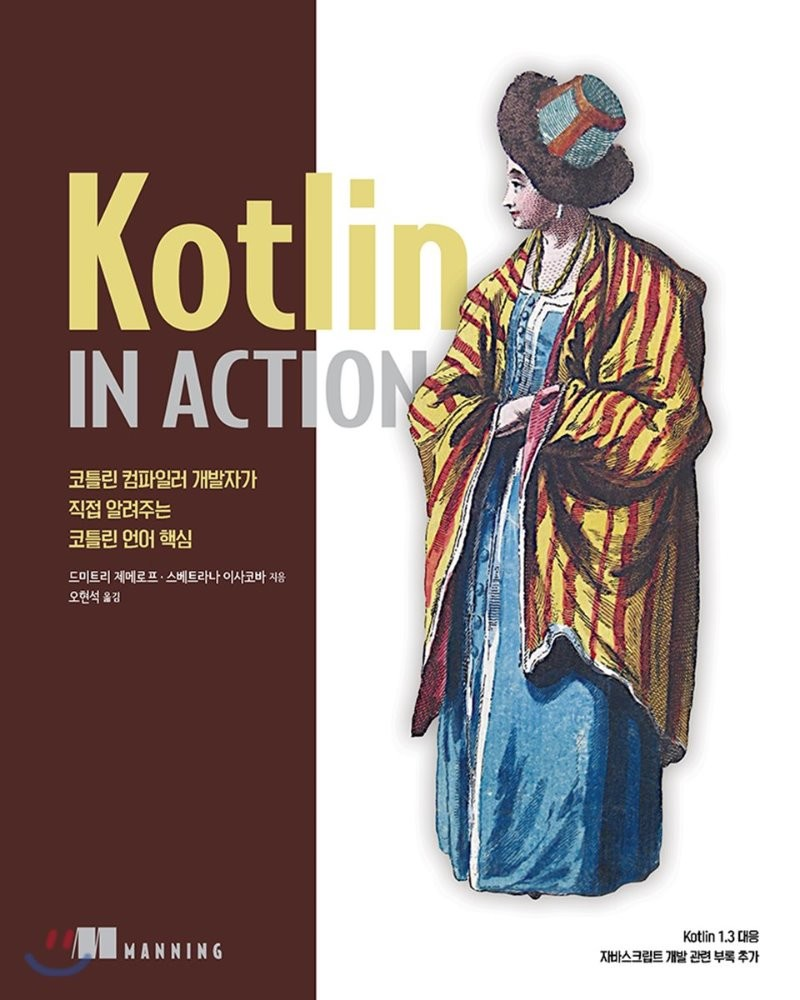

# Kotlin in Action

## 책 정보
  

## 목차
[1장. 코틀린이란 무엇이며, 왜 필요한가?](summary/chapter1.md)  
[2장. 코틀린 기초](summary/chapter2.md)    
[3장. 함수 정의와 호출](summary/chapter3.md)      
[4장. 클래스, 객체, 인터페이스](summary/chapter4.md)    
[5장. 람다로 프로그래밍](summary/chapter5.md)    
[6장. 코틀린 타입 시스템](summary/chapter6.md)    
[7장. 연산자 오버로딩과 기타 관례](summary/chapter7.md)     
[8장. 고차 함수: 파라미터와 반환 값으로 람다 사용](summary/chapter8.md)  
9장. 제네릭스  
10장. 애노테이션과 리플렉션  
11장. DSL 만들기  